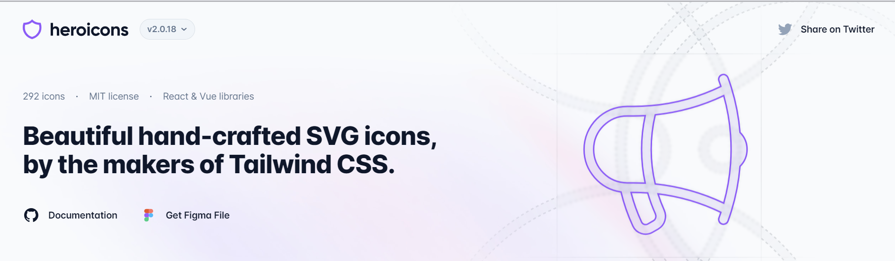

# [Install HeroIcons in VueJS3](https://heroicons.com)

<p align="center">
  <a href="https://heroicons.com/#gh-light-mode-only" target="_blank">
    
  </a>
</p>

<p align="center">
  Beautiful hand-crafted SVG icons, by the makers of Tailwind CSS. <br>Available as basic SVG icons and via first-party <a href="#vue">Vue</a> libraries.
<p>

## Install Using NPM

**Save Icons File**

```bash
npm install @heroicons/vue
```

---

## Uses in Template

**Use Solid and Outline Icons**

```html
<template>
  <!-- Solid Icon -->
  <UserIcon class="h-6 w-6 text-blue-500" />

  <!-- Outline Icon -->
  <BeakerIcon class="h-6 w-6 text-blue-500" />
</template>

<script setup>
  /* Import Solid Icons */
  import { UserIcon } from "@heroicons/vue/24/solid";

  /* Import Outline Icons */
  import { BeakerIcon } from "@heroicons/vue/24/outline";
</script>
```

## Some Useful Things

The 24x24 outline icons can be imported from `@heroicons/vue/24/outline`, the 24x24 solid icons can be imported from `@heroicons/vue/24/solid`, and the 20x20 solid icons can be imported from `@heroicons/vue/20/solid`.

Icons use an upper camel case naming convention and are always suffixed with the word `Icon`.

[Browse the full list of icon names on UNPKG &rarr;](https://unpkg.com/browse/@heroicons/vue/24/outline/)
